# 初心者でもAIで月10万稼ぐ副業入門

\newpage

## はじめに

あなたは今、こんなことを考えていませんか？

「副業を始めたいけど、何から手をつければいいかわからない」
「AIって聞くと難しそうで、自分には無理だと思ってしまう」
「毎月の収入をもう少し増やしたいけど、時間がない」

{ width=100% }

この本は、そんなあなたのために書きました。

**AIを使えば、副業の常識が変わります。**
かつては「副業で月10万円」というと、週末を丸ごと潰すか、特別なスキルが必要でした。
しかし今は違います。
ChatGPTやClaudeといったAIツールを活用することで、**1日1〜2時間の作業で月10万円**を達成している人が続々と登場しています。

生成AI活用者の年間副収入は平均**119万円**。
つまり月平均**約10万円**という数字が、すでに現実のものとなっています。

本書では、AIの知識ゼロから始めて、**5〜6ヶ月で月10万円を達成するロードマップ**を、具体的なステップとともに解説します。
難しい技術は一切不要です。
スマートフォンとパソコンがあれば、今日から始められます。

さあ、AIを味方にして、あなたの副業を加速させましょう。

\newpage

# 第1章　なぜ今、AI副業なのか

{ width=100% }

## 副業の常識を変えたAIの登場

2022年末にChatGPTが登場して以来、副業の世界は劇的に変わりました。
それまで「副業で稼ぐ」ためには、特定のスキルや長い下積み期間が必要でした。

{ width=100% }

ライティング副業なら、SEOの知識が必要でした。
デザイン副業なら、Photoshopを何年も練習する必要がありました。
プログラミング副業なら、数百時間の学習が前提でした。

**しかしAIはその常識を覆しました。**

AIに指示を出す（プロンプトを書く）だけで、プロ並みの文章・画像・コードが生成できる時代になったのです。

## 会社員こそAI副業が向いている理由

{ width=100% }

実は、**20〜50代の会社員こそAI副業に最も向いています。**

理由は4つあります。

まず、**安定した本業収入がある**ため、リスクを取らずに副業を試せます。
副業が軌道に乗るまで、焦る必要がありません。

次に、**本業の専門知識がそのまま武器になります。**
営業職なら営業コンテンツ制作、経理職なら財務系記事、医療職なら医療ライティングと、あなたの業界知識はAI副業で高単価を実現する最大の差別化要因です。

さらに、**スキマ時間を活用できます。**
通勤中、昼休み、寝る前の30分。
AIを使えば、細切れの時間でも質の高いアウトプットが出せます。

最後に、**初期費用がほぼゼロです。**
必要なのは月3,000〜6,000円のAIツール代だけ。
パソコンとスマートフォンさえあれば始められます。

## 月10万円は現実的な目標か

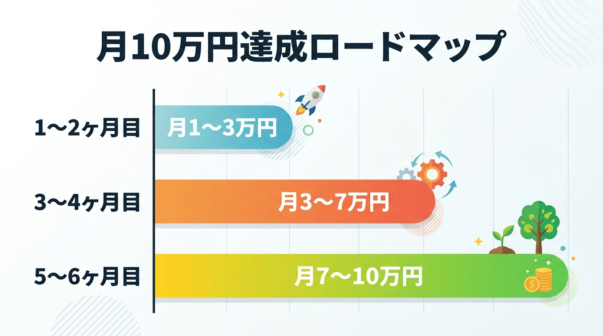{ width=100% }

「月10万円は難しそう」と思う方もいるでしょう。
しかし数字は明確です。

副業開始から1〜2ヶ月目は月1〜3万円。
3〜4ヶ月目には月3〜7万円。
そして5〜6ヶ月目には**月7〜10万円**を達成する人が続出しています。

これは平均的なデータです。
本書のロードマップ通りに進めば、多くの方が**6ヶ月以内に月10万円**を達成できます。

\newpage

# 第2章　まず始めるべきAIツール3選

{ width=100% }

## AIツール選びで失敗しない3つのポイント

AI副業を始めるにあたって、まず直面するのが「どのAIツールを使えばいいか」という問題です。
ChatGPT、Claude、Gemini、Midjourney……数えきれないほどのツールが存在します。

**初心者は欲張らず、まず3つのツールに絞りましょう。**

{ width=100% }

## ツール1：ChatGPT（月20ドル）

**ChatGPTは「副業のスイスアーミーナイフ」です。**

文章作成、アイデア出し、メール文案、SNS投稿、翻訳、要約……あらゆるテキスト作業をこなします。
無料プランでも使えますが、**月20ドル（約3,000円）のPlusプランへのアップグレードを強く推奨します。**

理由はシンプル。
GPT-4oが無制限で使えるようになり、作業効率が劇的に上がるからです。

月3,000円の投資で月10万円を稼げるなら、**回収率は33倍**です。

## ツール2：Claude（月20ドル）

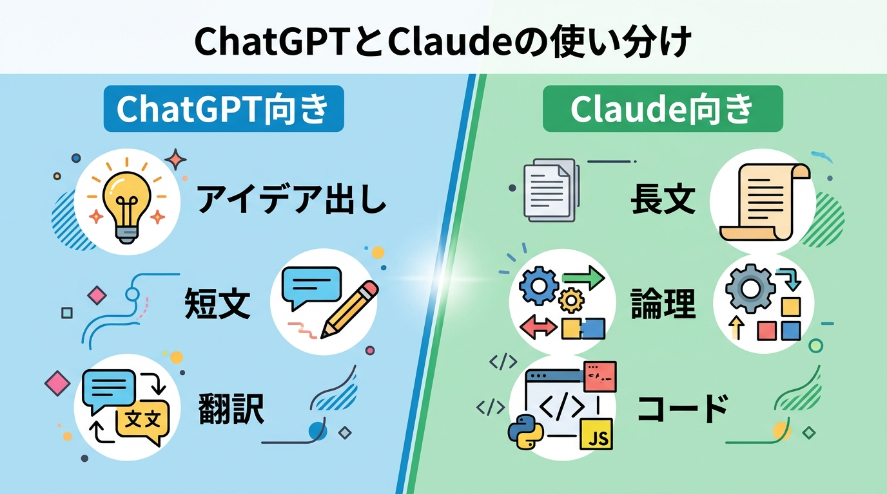{ width=100% }

ClaudeはAnthropicが開発したAIで、**長文の品質と論理的な文章においてはChatGPTを上回る**と多くのユーザーが評価しています。

特に、ブログ記事やビジネス文書など、**2,000字以上の長文コンテンツを書く場合はClaudeが有利**です。

また、Claude Codeという機能を使えば、**プログラミング未経験者でもWebサイトが作れます。**
実際に、IT企業の営業職（プログラミング未経験）がClaude Codeだけで月5万円のWeb制作副業を達成した事例も報告されています。

## ツール3：Canva（無料〜月1,500円）

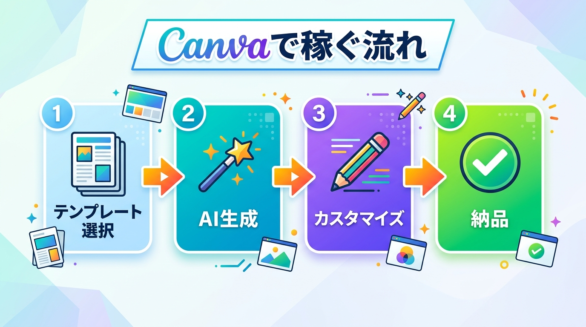{ width=100% }

**Canvaは「デザインの民主化」を実現したツールです。**

デザイン経験ゼロでも、プロ並みのSNS画像・サムネイル・プレゼン資料が数分で作れます。
さらにCanvaにはAI機能が搭載されており、テキストから画像を生成したり、背景を自動で消したりすることもできます。

SNS運用代行やサムネイル制作の副業では、Canvaは必須ツールです。
**無料プランでも十分稼げますが、月1,500円のProプランにすれば素材が格段に増え、作業効率も上がります。**

\newpage

# 第3章　今すぐ始められるAI副業5選

{ width=100% }

## AI副業の選び方：3つの軸

AI副業を選ぶときは、以下の3つの軸で考えましょう。

**①始めやすさ（スキル不要度）**
**②稼ぎやすさ（単価・需要）**
**③継続しやすさ（自動化しやすさ）**

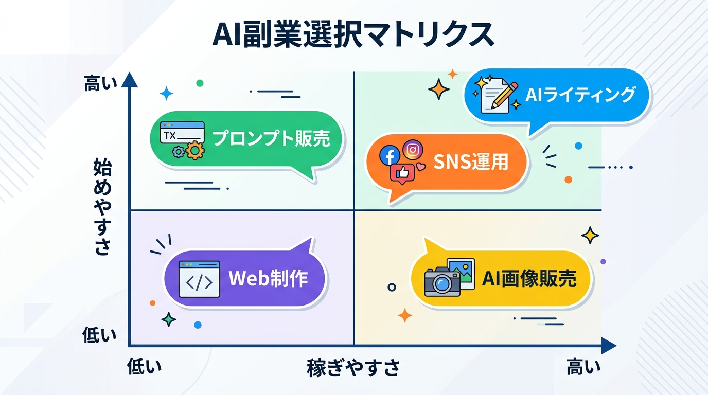{ width=100% }

## 副業1：AIライティング（月3〜10万円）

**最も始めやすいAI副業がライティングです。**

報酬は文字単価1〜3円が基本ですが、医療・法律・金融などの専門分野では1本3〜10万円の高単価案件も存在します。

始め方はシンプルです。
クラウドワークスやランサーズに登録し、「ライティング」案件に応募するだけです。
AIを使えば、1,000字の記事を30分で書けるようになります。

**1日2時間稼働、月20記事を書けば月3〜5万円は十分に達成できます。**

## 副業2：SNS運用代行（月5〜18万円）

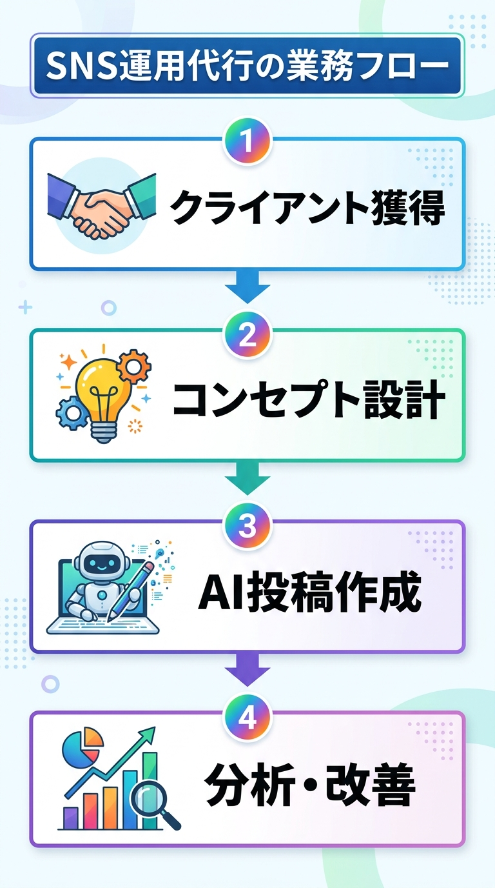{ width=100% }

SNS運用代行は、企業や個人のInstagram・X・TikTokを代わりに運用する副業です。

月3〜5万円/社が相場で、**3社受注すれば月9〜15万円**になります。
ChatGPTで投稿文を作り、Canvaで画像を制作すれば、1社あたりの作業時間は週3〜4時間程度です。

**本業で得た業界知識を持つあなたなら、その業界のクライアントを専門的に支援できます。**
これが他の副業者との最大の差別化ポイントです。

## 副業3：AI画像生成・販売（月1〜5万円）

**AI画像販売はストック型の副業で、一度アップロードすれば継続して収入が入ります。**

MidjourneyやAdobe Fireflyで画像を生成し、PIXTAやAdobe Stockに出品します。
最初の1〜2ヶ月は収入が少ないですが、**500〜1,000枚を蓄積すれば月1〜5万円の不労所得**になります。

{ width=100% }

## 副業4：プロンプト販売（月3〜20万円）

プロンプトとは、AIへの「指示文」のことです。
質の高いプロンプトを作成し、PromptBaseやnoteで販売するビジネスです。

**専門性の高いプロンプトは1つ1,000〜5,000円で売れます。**
医療・法律・マーケティング・プログラミングなど、本業の専門知識を活かしたプロンプトは需要が高いです。

## 副業5：Claude Code活用Web制作（月5〜30万円）

{ width=100% }

**Claude Codeは、AIにプログラミングを代行させる革命的なツールです。**

「トップページを作って」「お問い合わせフォームを追加して」と日本語で指示するだけで、AIが自動でコードを書いてくれます。

プログラミング未経験のIT企業営業職が180日間でWeb制作月5万円を達成した事例は、決して特別なことではありません。
**あなたにもできます。**

\newpage

# 第4章　月10万円達成の具体的ロードマップ

{ width=100% }

## 準備期（0〜2週間）：土台を作る

**まず最初の2週間は、稼ぐ前の準備に集中しましょう。**

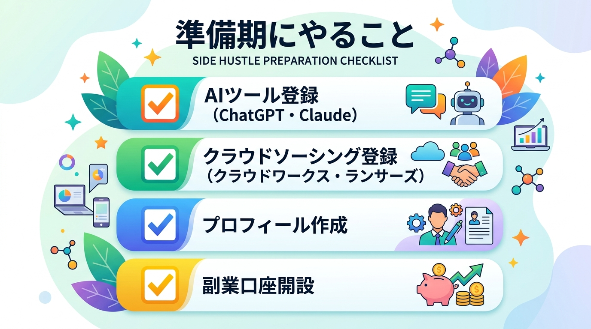{ width=100% }

やることは4つです。

ChatGPTとClaudeに登録します。
最初は無料プランでOKです。
稼ぎ始めたら有料プランに切り替えましょう。

次に、クラウドワークスとランサーズに登録します。
プロフィールは**本業の経験・スキルを具体的に記載**してください。
「10年の営業経験あり」「医療業界5年」など、本業の実績がそのまま強みになります。

最後に、**副業専用の銀行口座を開設します。**
収入管理と確定申告を楽にするための重要な準備です。

## 立ち上げ期（1〜2ヶ月目）：月1〜3万円を目指す

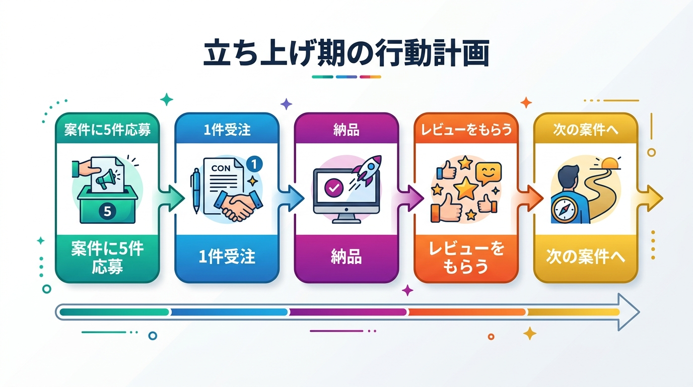{ width=100% }

**最初の目標は「月1万円」です。**

月10万円ではなく、まず月1万円。
これが重要です。

最初の1万円を稼ぐことで、「自分にもできる」という自信がつきます。
その自信が次の行動を生み、収入が加速します。

具体的には、クラウドソーシングで**単価の低い案件に積極的に応募**します。
最初は文字単価0.5円でも構いません。
実績とレビューを積み上げることが最優先です。

**5件応募して1件受注できれば十分です。**
断られることを恐れないでください。

## 成長期（3〜4ヶ月目）：月3〜7万円を目指す

**3ヶ月目から、戦略を変えます。**

単価交渉を始めましょう。
2ヶ月の実績とレビューがあれば、文字単価を1〜2円に上げる交渉が十分可能です。

また、**得意分野に特化します。**
「AIライティング×医療」「SNS運用×飲食業界」など、ニッチな専門性を持つことで単価が跳ね上がります。

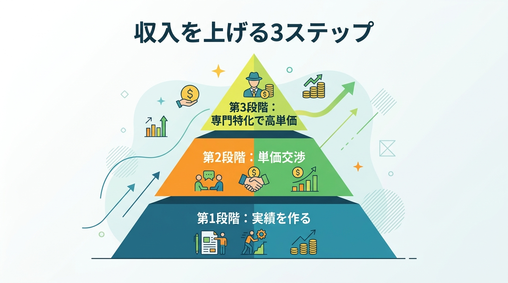{ width=100% }

この時期に**2つ目の副業を追加**することもおすすめします。
ライティングに慣れてきたら、SNS運用代行を始めるなど、収入の柱を増やしましょう。

## 安定期（5〜6ヶ月目）：月7〜10万円を達成する

**5ヶ月目に入ると、仕組み化と自動化が重要になります。**

毎回ゼロから作業するのではなく、**テンプレートとプロンプトを作成して効率化**します。

よく使うプロンプトをメモ帳に保存しておき、コピー＆ペーストで使い回せるようにします。
記事の構成テンプレート、SNS投稿テンプレート、提案文テンプレート……これらを整備するだけで作業時間が半分以下になります。

**時間が空いたら、新しいクライアントを獲得します。**
6ヶ月で**月10万円の壁を突破**しましょう。

\newpage

# 第5章　収入を加速させる上級テクニック

{ width=100% }

## テクニック1：本業の専門性で単価を10倍にする

**「初心者ライター」と「医療専門ライター」では、単価が10倍違います。**

一般的なライターの文字単価が1〜2円のところ、医療・法律・金融・ITなどの専門分野では文字単価5〜10円、1記事3〜10万円も珍しくありません。

{ width=100% }

あなたが10年間積み上げてきた業界知識は、副業市場では**希少価値の高い資産**です。
今すぐ「本業の専門性×AI」の組み合わせを武器にしましょう。

## テクニック2：リピートクライアントを作る

新規クライアントを獲得するより、既存クライアントにリピートしてもらう方が**5倍効率的**です。

納品後に「他にお手伝いできることはありますか？」と一言添えるだけで、リピート率が大幅に上がります。

**毎月5社のリピートクライアントを持てば、安定した月10万円以上の収入が実現します。**

## テクニック3：プロンプトを商品として販売する

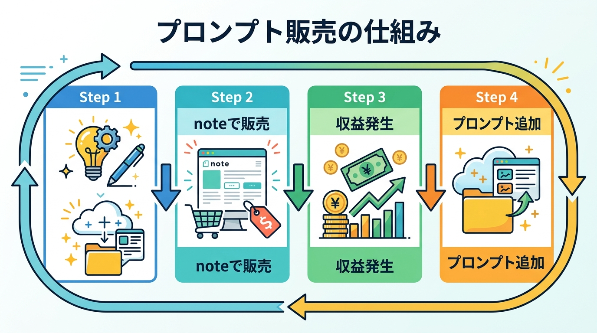{ width=100% }

副業で蓄積した優秀なプロンプトは、**そのまま商品として販売できます。**

noteで1つ1,000〜3,000円で販売し、月10本売れれば月1〜3万円の追加収入になります。
一度作れば繰り返し売れる、**最も効率の良い収入源の一つ**です。

## テクニック4：外注化で収入を2倍にする

月10万円を安定的に超えてきたら、**外注化を検討しましょう。**

自分が獲得した案件の一部を、他のフリーランサーに依頼します。
例えば、クライアントから月5万円の案件を受注し、2万円で外注すれば、**差額の3万円が利益**になります。

これを複数の案件で行えば、自分の作業時間を増やさずに収入を倍増できます。

## テクニック5：情報商材・コンテンツ販売に展開する

**月10万円を達成したあなたには、価値ある経験が蓄積されています。**

その経験を「ノウハウコンテンツ」として販売しましょう。
noteやUdemyで「AI副業で月10万円達成した方法」を販売すれば、副業収入がさらに加速します。

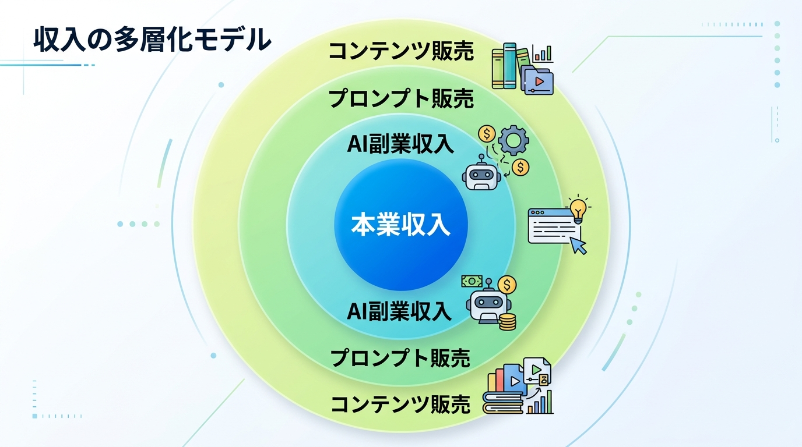{ width=100% }

**副業で稼いだ実績は、次の副業の最高の営業ツールになります。**
月10万円達成は、さらなる収入拡大のスタートラインです。

\newpage

## おわりに

ここまで読んでいただき、ありがとうございます。

本書を通じて、AI副業の全体像と具体的な稼ぎ方をお伝えしてきました。
最後に、最も重要なことをお伝えします。

**「完璧な準備ができてから始める」は、永遠に始まりません。**

AIツールの使い方は、使いながら覚えるものです。
最初の案件は緊張するかもしれません。
でも、最初の1,000円を稼いだとき、あなたの世界は確実に変わります。

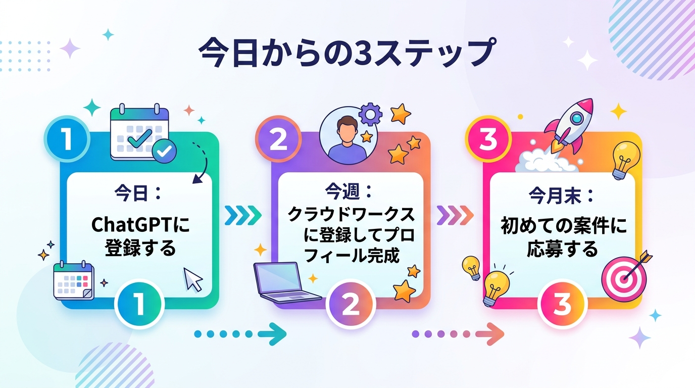{ width=100% }

**今日、一つだけ行動してください。**

ChatGPTに登録するだけでいい。
それだけで、あなたはAI副業の第一歩を踏み出したことになります。

6ヶ月後、月10万円の副収入を手にしたあなたが、この本を読み返したとき、「あのとき始めてよかった」と思えることを心から願っています。

**あなたの副業成功を、心から応援しています。**
