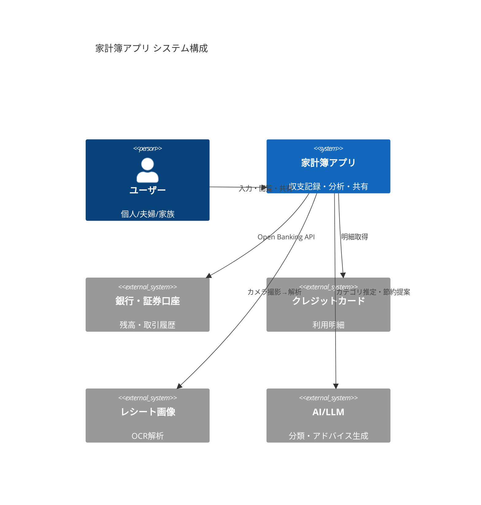
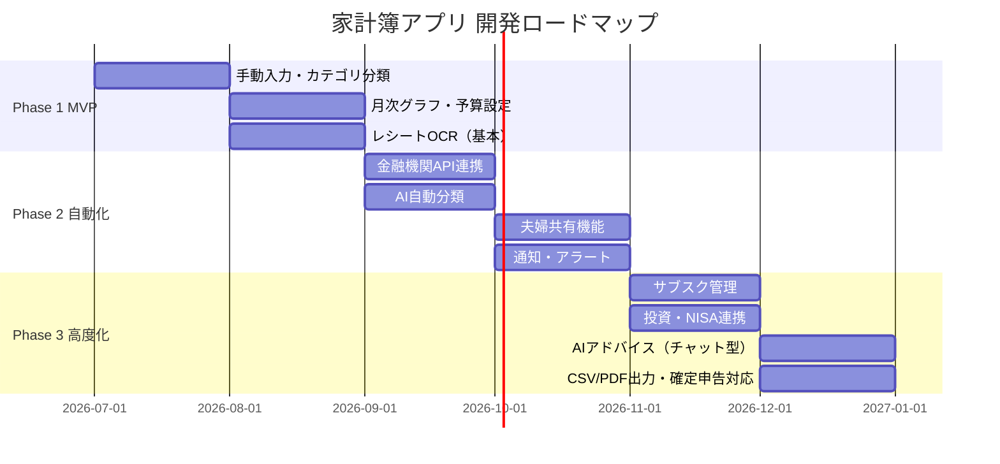

# 家計簿アプリ 機能調査レポート
生成日: 2026-06-11 | システム: TAISUN v2 無料版

---

## 1. Executive Summary

家計簿アプリに求められる機能は「記録の手間をゼロに近づけること」と「見える化→行動変容」の2軸に集約される。
2026年時点で差別化の核となるのは AI 自動分類・レシートOCR・金融機関連携の三点セット。
これに加え、家族共有・サブスク管理・投資連携が"次の標準機能"として台頭している。

---

## 2. 機能マップ（全体像）

```
家計簿アプリ機能ツリー
│
├── [必須] 入力系
│   ├── 手動入力（収入・支出）
│   ├── レシートOCR読み取り
│   ├── 金融機関・クレカ自動連携
│   └── 固定費の定期自動入力
│
├── [必須] 分類・管理系
│   ├── カテゴリ自動分類（AI）
│   ├── カスタムカテゴリ作成
│   ├── 月次・年次予算設定
│   └── カレンダー表示
│
├── [必須] 可視化系
│   ├── 支出グラフ（円・棒・折れ線）
│   ├── 月次レポート自動生成
│   └── 残高推移表示
│
├── [差別化] 分析・提案系
│   ├── AI節約アドバイス
│   ├── 支出パターン分析
│   ├── 予算ペース警告（ペーシング）
│   └── 家計診断スコア
│
├── [差別化] 共有・連携系
│   ├── 夫婦・家族共有
│   ├── 個人/共有家計の分離管理
│   ├── サブスクリプション管理・解約提案
│   └── 投資口座・NISA/iDeCo連携
│
├── [差別化] 目標・継続系
│   ├── 貯蓄目標設定と進捗
│   ├── 通知・アラート（残高低下・引落前）
│   ├── ポイ活連携
│   └── ストリーク（継続記録）
│
└── [付加価値] 出力・セキュリティ系
    ├── CSV/PDF出力（確定申告対応）
    ├── パスコード・生体認証ロック
    ├── クラウドバックアップ
    └── オフライン動作
```

---

## 3. Keyword Universe

| カテゴリ | キーワード |
|---------|-----------|
| コア機能 | 収支記録, カテゴリ分類, 予算管理, グラフ可視化 |
| 自動化 | レシートOCR, 金融機関連携, AI自動分類, 自動入力 |
| 分析 | 支出パターン, 節約提案, 家計診断, ペーシング |
| 共有 | 夫婦共有, ペア家計簿, 家族財布, シェアボード |
| 投資 | NISA, iDeCo, ポートフォリオ, 資産管理 |
| 継続 | 通知, アラート, ストリーク, ポイ活, ゲーミフィケーション |
| 出力 | CSV出力, PDF, 確定申告, バックアップ |
| セキュリティ | 生体認証, パスコード, オフライン, プライバシー |

---

## 4. データ取得戦略（調査ソース）

| ソース | 取得情報 |
|--------|---------|
| アスピック 2026年版比較記事 | 機能一覧・差別化機能 |
| NerdWallet / CNBC 2026 | 海外バジェットアプリ機能比較 |
| アプリブ・マイベスト レビュー集計 | ユーザーニーズ・不満点 |
| renue.co.jp AI家計簿解説 | AI機能トレンド詳細 |
| Amebaチョイス 461名調査 | 実ユーザー評価 |
| Quicken / Monarch / Copilot | 海外先進機能（投資・サブスク） |

---

## 5. TrendScore（機能別 hot/warm/cold）

| 機能 | スコア | 根拠 |
|------|--------|------|
| AI自動分類・節約提案 | 🔥 hot | 2026年主要アプリ全社が搭載。「AI入力95%削減」訴求が増加 |
| レシートOCR | 🔥 hot | 全主要アプリ共通機能。精度競争フェーズ |
| 金融機関自動連携 | 🔥 hot | マネフォ2,400社以上。標準化完了 |
| 夫婦・家族共有 | 🔥 hot | OsidOri・マネフォシェアボードなど専用UIが増加 |
| サブスクリプション管理 | 🌡️ warm | 海外では標準（PocketGuard・Monarch）、国内はこれから |
| 投資・NISA/iDeCo連携 | 🌡️ warm | マネフォが先行。他アプリは追随中 |
| ペーシング（残予算+日数） | 🌡️ warm | 海外YNAB・Simplifiで実績。国内導入は少数 |
| ゲーミフィケーション/ポイ活 | 🌡️ warm | ポイ活系アプリが増加中 |
| 確定申告CSV出力 | ❄️ cold | 既存機能として定着。差別化にならず |
| 手動入力UI改善 | ❄️ cold | 重要だが競合優位にならない |

---

## 6. システムアーキテクチャ図（参考実装）



---

## 7. 実装計画（3フェーズ）



---

## 8. リスクと代替案

| リスク | 影響 | 代替案 |
|--------|------|--------|
| 金融機関API取得の審査が長い | Phase 2 遅延 | まずスクレイピング or CSV手動インポートで代替 |
| OCR精度が低い（レシート種類多様） | UX低下・離脱 | Google Vision API / AWS Textract で精度担保 |
| セキュリティ懸念でユーザーが連携を嫌がる | 登録率低下 | 連携なしでも使えるオフラインモードを標準提供 |
| AI分類の誤りが多い | 信頼失墜 | ユーザー修正UIを充実させ学習データに活用 |
| 有料機能への誘導が強すぎる | 離脱 | 基本機能は永続無料、プレミアムは差別化機能のみ |

---

*Sources: アスピック, アプリブ, NerdWallet, CNBC, renue.co.jp, Amebaチョイス, Quicken, Monarch*
